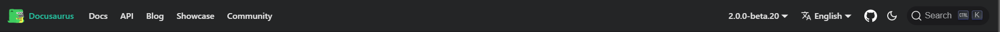

# ナビゲーションバー

[Docusaurus](https://docusaurus.io/) 公式のナビゲーションバーみたいに、複数項目をナビゲーションバーに置けるかテスト



## ナビゲーションバーの項目変更

`docusaurus.config.js` の中にある `themeConfig.navbar` で行う。

例えば、項目を増やす場合は以下のようにする。

```diff
      navbar: {
        title: 'My Site',
        logo: {
          alt: 'My Site Logo',
          src: 'img/logo.svg',
        },
        items: [
          {
            type: 'doc',
            docId: 'intro',
            position: 'left',
            label: 'Tutorial',
          },
+         {
+           type: 'doc',
+           docId: 'navbar/index',
+           position: 'left',
+           label: 'Test',
+         },
          { to: '/blog', label: 'Blog', position: 'left' },
          {
            href: 'https://github.com/facebook/docusaurus',
            label: 'GitHub',
            position: 'right',
          },
        ],
      },
```

## サイドバーに表示するコンテンツの変更

`sidebar.js` で行う。[`autogenerated`](https://docusaurus.io/docs/sidebar/autogenerated)させない場合は、頑張って書くしかない。

[`autogenerated`](https://docusaurus.io/docs/sidebar/autogenerated)させる場合は楽だが、[`generated-index`](https://docusaurus.io/docs/sidebar/items#generated-index-page)が使えなさそう。
